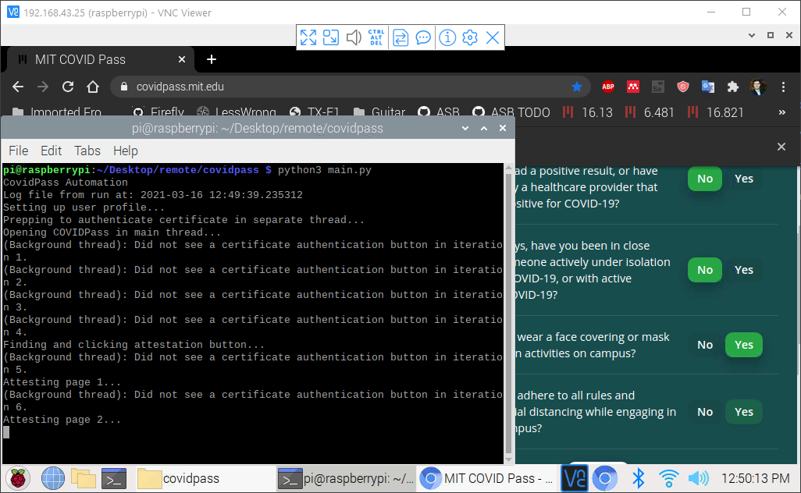

Steps:

1. Put this folder on a Raspberry Pi.

2. If you want to get a Pushbullet notification on your phone whenever the script doesn't work:

    * Create a [Pushbullet](https://www.pushbullet.com/) account.
    
    * Download the app on your phone and allow notifications.
   
    * Go to your [Accounts page](https://www.pushbullet.com/#settings/account) on the Pushbullet website and create an access token.
   
    * Create a JSON file in this directory called `credentials.json` with one entry called `{"pushbullet_token": "<insert your token here>"}`. For obvious reasons, don't commit this to Git if you fork this repository.
   
    That's it! (If you don't want Pushbullet , you might need to tweak `main.py` to remove the `pushbullet_message` part.) 

3. Set up `cron` to autorun `python3 main.py` or similar every few hours.

    * This will look something like `crontab -e` to get into the editor, and then you'll want to add a line at the end that looks something like this:
   
   ```
   0 */6 * * * python3 /home/pi/Desktop/remote/covidpass/main.py > home/pi/Desktop/remote/covidpass/log.txt 2>&1
   ```

    * The first time you run the script (and every 30 days or so), you might need to manually attest so that MIT's Duo Auth auto-remembers your MIT login.
   
If you do it right, you'll see something like this every 6 hours, and it'll completely attest on its own:

